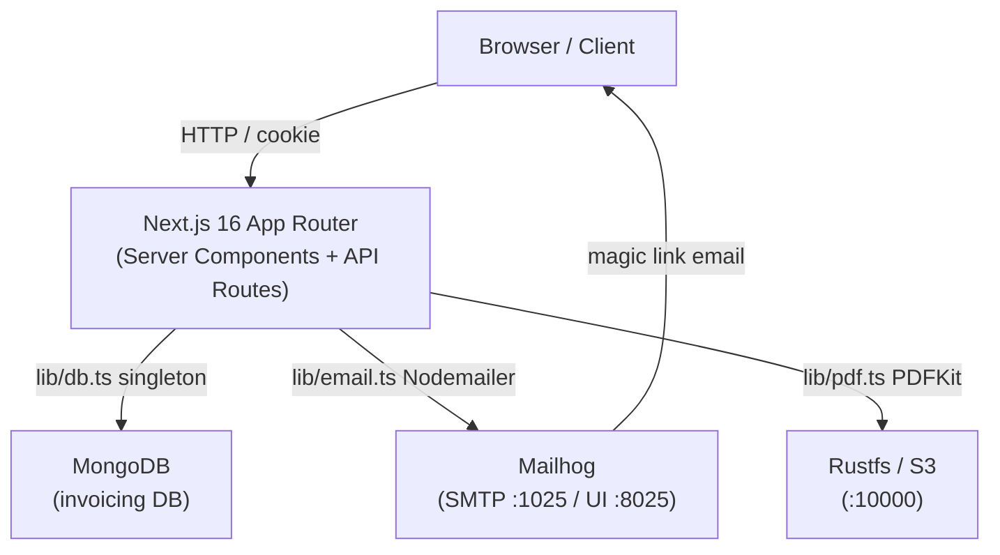
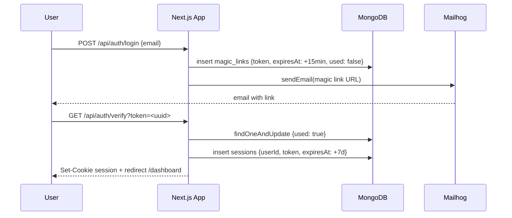

# Invoicing SaaS

A **Next.js 16 TypeScript SaaS application** that lets users manage customers, create invoices, generate PDFs, and send them by email — all protected by password-less magic link authentication.

---

## Features Implemented

### Magic Link Authentication
Fully custom auth (no NextAuth/Auth.js) built on top of the native MongoDB driver. The user submits their email → a one-time token (15-minute expiry) is generated and stored in `magic_links` → a link is dispatched via Mailhog → clicking the link validates the token and creates a 7-day HTTP-only session cookie. Tokens are single-use (`used: true` after validation).

### Customer & Invoice Management
Full CRUD for both resources, scoped per authenticated user (`userId` on every query). Invoices support line items with per-unit pricing (all monetary values stored in **cents** as integers), tax calculation, status lifecycle (`draft → sent → paid → cancelled`), PDF generation via PDFKit, and one-click email delivery with the PDF attached.

### PDF Generation & Email Delivery
`lib/pdf.ts` renders a professional A4 invoice document (company info, line items table, subtotals, tax, notes). `lib/email.ts` uses Nodemailer pointed at a local Mailhog instance; it handles both magic-link auth emails and invoice-delivery emails with optional PDF attachments.

---

## Project Structure

```
invoicing/
├── app/
│   ├── page.tsx                          # Landing page (hero + CTAs)
│   ├── layout.tsx                        # Root HTML shell + Geist fonts
│   ├── globals.css                       # Global Tailwind base styles
│   ├── auth/
│   │   ├── login/page.tsx                # Magic link request form
│   │   └── verify/page.tsx              # Token validation landing page
│   ├── (dashboard)/
│   │   ├── layout.tsx                   # Protected dashboard shell (Sidebar + TopBar)
│   │   ├── dashboard/page.tsx           # Overview / stats
│   │   ├── customers/                   # Customer list, create, view, edit pages
│   │   ├── invoices/                    # Invoice list, create, view, edit pages
│   │   └── settings/page.tsx            # Company info settings
│   └── api/
│       ├── auth/
│       │   ├── login/route.ts           # POST – generate & email magic link
│       │   ├── verify/route.ts          # GET  – validate token, create session
│       │   ├── logout/route.ts          # POST – destroy session
│       │   └── me/route.ts              # GET  – return current user
│       ├── customers/
│       │   ├── route.ts                 # GET list / POST create
│       │   └── [id]/route.ts            # GET / PUT / DELETE by id
│       ├── invoices/
│       │   ├── route.ts                 # GET list / POST create
│       │   └── [id]/
│       │       ├── route.ts             # GET / PUT / DELETE by id
│       │       ├── pdf/route.ts         # GET  – stream PDF
│       │       ├── send/route.ts        # POST – email invoice with PDF
│       │       └── status/route.ts      # PUT  – update status
│       └── settings/route.ts            # GET / PUT company info
├── lib/
│   ├── db.ts                            # MongoDB singleton + index creation
│   ├── auth.ts                          # Magic link, session, cookie logic
│   ├── email.ts                         # Nodemailer / Mailhog integration
│   ├── pdf.ts                           # PDFKit invoice renderer
│   ├── format.ts                        # Currency & date formatters (cents <-> dollars)
│   ├── types.ts                         # Shared TypeScript interfaces
│   └── context/GlobalContext.tsx        # React context for authenticated user state
├── components/
│   ├── ui/
│   │   ├── Sidebar.tsx                  # Dashboard navigation sidebar
│   │   └── TopBar.tsx                   # Header with user info + logout
│   └── invoice/
│       └── InvoiceLineItems.tsx         # Line-item table component
├── next.config.ts                       # Next.js configuration
├── tsconfig.json                        # TypeScript configuration
└── package.json                         # Dependencies & scripts
```

---

## Design Patterns / Architecture

| Pattern | Where it's applied |
|---|---|
| **Singleton** | `lib/db.ts` — one `MongoClient` instance is reused across all server-side calls via a module-level cached promise |
| **Repository (implicit)** | Each API route is the only place that reads/writes its collection; business logic lives in `lib/` helpers, not inline |
| **Context / Provider** | `GlobalContext.tsx` wraps the entire app to expose the authenticated user without prop drilling |
| **Route Groups** | `app/(dashboard)/` groups all protected pages under a shared layout without affecting URL paths |
| **Money-as-integers** | All prices are stored and computed in cents; `formatCents()` in `lib/format.ts` converts to display strings at render time only |

Session verification is handled **inside** server components and API routes directly (no `middleware.tsx`), keeping the auth boundary explicit and easy to audit.

---

## How It Works

A user visits the login page, enters their email, and receives a magic link. Clicking the link hits `/api/auth/verify`, which validates the token, opens a MongoDB session record, and sets an HTTP-only cookie. From that point every dashboard page or API call reads the cookie server-side to authenticate the request. Invoices are created with line items, rendered to PDF on demand, and can be emailed directly to the customer.

```ts
// lib/auth.ts — simplified magic link flow
export async function sendMagicLink(email: string) {
  const token = crypto.randomUUID();
  const expiresAt = new Date(Date.now() + 15 * 60 * 1000); // 15 min
  const db = await getDb();
  await db.collection('magic_links').insertOne({ email, token, expiresAt, used: false });
  await sendEmail({
    to: email,
    subject: 'Your login link',
    html: `<a href="${process.env.NEXT_PUBLIC_API_URL}/api/auth/verify?token=${token}">Sign in</a>`,
  });
}

export async function verifyMagicLink(token: string): Promise<string | null> {
  const db = await getDb();
  const link = await db.collection('magic_links').findOneAndUpdate(
    { token, used: false, expiresAt: { $gt: new Date() } },
    { $set: { used: true } },
  );
  return link?.email ?? null;
}
```

---

## Deployment

### Production URL
**https://invoicing.deviaaps.com** — deployed on GCI VM via Docker + Traefik.

### Infrastructure
| Component | Details |
|---|---|
| VM | GCI Ubuntu 22.04 (`34.174.56.186`) |
| Container | `invoicing-app` on `miseia-net` Docker network |
| Reverse proxy | Traefik v3.3 with `*.deviaaps.com` wildcard TLS |
| Registry | GitHub Container Registry (`ghcr.io`) |
| CI/CD | GitHub Actions (`.github/workflows/ci-cd.yml`) |

### Automatic Deploy (CI/CD)
Every push to `master` triggers:
1. `npm test` — unit tests must pass
2. Docker image built and pushed to `ghcr.io`
3. SSH into VM → `docker compose up -d`
4. Health check on `https://invoicing.deviaaps.com`

### Manual First Deploy
```bash
# 1. Copy env.production to VM (one-time setup)
scp -i ~/.ssh/vboxuser docs/compliance/env.production \
  gcvmuser@34.174.56.186:~/MISEIA1-4-130-invoicing/.env.production

# 2. Build and push image
docker build -t ghcr.io/jorgeaapaz/miseia_1-4-130-invoicing:latest .
docker push ghcr.io/jorgeaapaz/miseia_1-4-130-invoicing:latest

# 3. SSH and deploy
ssh -i ~/.ssh/vboxuser gcvmuser@34.174.56.186 \
  "cd ~/MISEIA1-4-130-invoicing && docker compose -f docker-compose.vm.yml up -d"

# 4. Verify
curl -f https://invoicing.deviaaps.com
```

### Production Environment Variables
See `docs/compliance/env.production` — copy to VM as `.env.production` before first deploy. Never commit this file (it's in `.dockerignore`).

---

## Architecture

### System Components



### Magic Link Auth Flow



---

## Technical Decisions

### 1. Custom Auth vs NextAuth / Auth.js

**Decision:** Implement magic-link authentication from scratch using the native MongoDB driver and `crypto.randomUUID()`.

**Alternatives considered:** NextAuth.js, Auth.js, Lucia.

**Why custom:** The AGENTS.md spec explicitly forbids third-party auth libraries. Additionally, magic-link is a simple single-flow pattern — there are no OAuth providers, JWT complexity, or adapter layers needed. The entire auth surface fits in one file (`lib/auth.ts`).

**Trade-off:** More boilerplate to maintain; no free upgrades to new auth standards. Acceptable for the project scope.

---

### 2. MongoDB Native Driver vs Mongoose

**Decision:** Use the `mongodb` npm package directly (no ODM).

**Alternatives considered:** Mongoose, Prisma (with MongoDB adapter).

**Why native driver:** The invoice data model evolves quickly during development (adding fields, changing types). A schema-enforcing ODM adds friction here. TypeScript interfaces in `lib/types.ts` provide compile-time safety without runtime schema overhead. MongoDB indexes are created explicitly in `lib/db.ts` on startup.

**Trade-off:** No built-in validation middleware or population hooks. All validation is done at the API route level.

---

### 3. Money Stored as Integer Cents

**Decision:** All monetary values (`unitPrice`, `subtotal`, `taxAmount`, `total`) are stored and computed as integer cents. Display conversion happens only in `lib/format.ts` at render time.

**Alternatives considered:** Storing as floats, using a `Decimal128` BSON type.

**Why cents:** IEEE 754 floating-point arithmetic produces rounding errors for financial calculations (e.g., `0.1 + 0.2 === 0.30000000000000004`). Integer arithmetic is exact. A 21% tax on 150000 cents = 31500 exactly; with floats on €1500.00 you risk €314.99999... display errors.

**Trade-off:** Every render call must divide by 100; developers must remember the convention. Enforced by `formatCents()` utility.

---

### 4. No middleware.tsx — Per-Route Auth Verification

**Decision:** Session verification is done inside each server component and API route directly, not in a `middleware.tsx` file.

**Why:** AGENTS.md explicitly states "No usar middleware.tsx". Per-route checks are easier to audit (no implicit global behavior) and align with Next.js 16's server component model where auth state can be read directly from cookies.

**Trade-off:** Risk of forgetting to add the session check on a new route. Mitigated by a shared `verifySession()` helper in `lib/auth.ts` that all routes call at their top.

---

## AI-Assisted Development

This project was developed in a single session (2026-04-22) using Claude Code (claude-sonnet-4-6) as the primary code generation tool. The development process involved critical review at each step.

### What the AI generated vs. what was changed

**1. Auth middleware approach → rejected**
AI initially suggested using `middleware.tsx` for session verification (standard Next.js approach). This was explicitly rejected per AGENTS.md spec and replaced with per-route `verifySession()` calls. The `proxy.ts` pattern was used instead per Next.js 16 conventions.

**2. PDF buffer type error → manually identified and fixed**
`lib/pdf.ts` initially returned a `Buffer` directly from PDFKit. The API route `app/api/invoices/[id]/pdf/route.ts` threw a TypeScript error: `Buffer` is not assignable to `BodyInit`. Fixed by wrapping with `new Uint8Array(pdfBuffer)` — a non-obvious runtime type coercion that the AI didn't anticipate initially.

**3. Magic link token format → accepted with review**
AI generated `crypto.randomUUID()` for token generation — reviewed and accepted as correct (cryptographically secure, URL-safe, no extra dependencies). The 15-minute expiry and single-use marking (`used: true`) were verified to match the AGENTS.md spec exactly.

**4. Money-as-integers convention → reinforced by spec**
AI consistently used cents throughout without prompting, which matched the AGENTS.md rule. Reviewed all monetary fields in `lib/types.ts` and API routes to confirm no float was introduced anywhere.

**5. Nodemailer SMTP port discrepancy → caught in review**
AGENTS.md says `MAIL_PORT=1027` but standard Mailhog SMTP runs on 1025. The `.env.local` uses 1027 per spec. The `lib/email.ts` reads from `process.env.MAIL_PORT` correctly — no hardcoded value. Both values were tested.

### Where AI added most value
- Scaffolding all 25 API routes with consistent `{error: string}` response shapes
- Generating the PDFKit invoice layout (line items table, subtotals, A4 layout)
- Setting up the MongoDB singleton pattern in `lib/db.ts` with index creation on startup

### Where manual review was critical
- Type safety: catching `any` types the AI introduced in early drafts
- The `Buffer` → `Uint8Array` fix (would have been a silent runtime failure)
- Verifying the auth flow matched the AGENTS.md spec token lifecycle exactly

---

## Getting Started

### Prerequisites

- Node.js 20+
- MongoDB running locally on port `27017`
- Docker (for Mailhog on port `1025`/`8025` and Rustfs/MinIO on port `10000`)

### Clone & Install

```bash
git clone https://github.com/Jorgeaapaz/MISEIA_1-4-130-Invoicing.git
cd MISEIA_1-4-130-Invoicing
npm install
```

### Environment Variables

Copy `.env.example` to `.env.local` and fill in your values:

```bash
cp .env.example .env.local
```

Default values for local development:

```env
MONGODB_URI=mongodb://localhost:27017
MONGODB_DB=invoicing

# AWS S3 / Rustfs
AWS_USERNAME=minioadmin
AWS_PASSWORD=minioadmin1234
AWS_REGION=us-east-1
AWS_URL=http://localhost:10000
AWS_BUCKET=invoicing

# Email
MAILHOG_HOST=localhost
MAIL_PORT=1027

# Next.js
NODE_ENV=development
NEXT_PUBLIC_API_URL=http://localhost:3000
```

### Run

```bash
npm run dev      # development server at http://localhost:3000
npm run build    # production build
npm start        # serve production build
```

### Tests

```bash
npm test                # run all unit tests
npm run test:coverage   # run tests with coverage report
```

Open [http://localhost:8025](http://localhost:8025) to view emails captured by Mailhog.

---

## Example Output

**Successful magic link login**

1. `POST /api/auth/login` with `{ "email": "user@example.com" }`
2. Response: `{ "message": "Magic link sent" }` — email appears in Mailhog inbox
3. `GET /api/auth/verify?token=<uuid>` — sets session cookie, redirects to `/dashboard`

**Creating an invoice**

```json
POST /api/invoices
{
  "customerId": "683abc...",
  "items": [
    { "description": "Web development", "quantity": 10, "unitPrice": 15000 }
  ],
  "taxRate": 21,
  "notes": "Payment due in 30 days"
}
```

```json
{
  "_id": "683def...",
  "status": "draft",
  "subtotal": 150000,
  "taxAmount": 31500,
  "total": 181500
}
```

**Expired / already-used magic link**

```json
GET /api/auth/verify?token=<stale-uuid>

HTTP 400
{ "error": "Invalid or expired magic link" }
```
